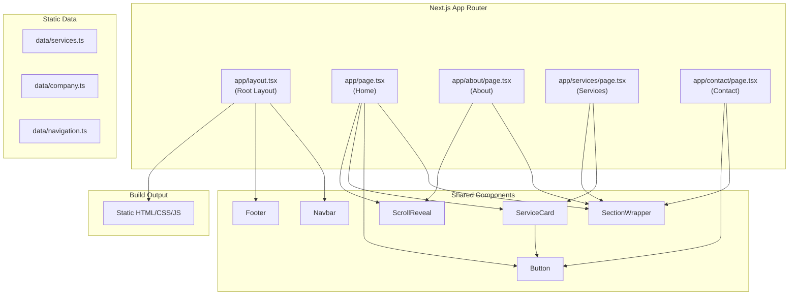

# Design Document

## Overview

This design document describes the technical architecture for the "Cabinet de Gestion et Conseil" corporate website — a premium, fully static Next.js site with four pages (Home, About, Services, Contact), a gold-and-white luxury visual identity, and no backend dependencies.

The site uses Next.js 14 App Router with static export, Tailwind CSS for styling, and a component-based architecture. It targets deployment on any static hosting provider (Vercel, Netlify, GitHub Pages, etc.) with zero server-side runtime requirements.

### Key Design Decisions

1. **Next.js App Router with Static Export**: Chosen for modern React patterns (Server Components for static rendering), file-based routing, and built-in metadata API for SEO.
2. **Tailwind CSS (no additional UI library)**: Keeps the bundle minimal, provides utility-first responsive design, and avoids third-party CSS dependencies.
3. **No external animation library**: CSS-only animations via Tailwind's `transition` and `animate` utilities plus Intersection Observer for scroll-triggered reveals. This keeps the JS bundle small and respects `prefers-reduced-motion`.
4. **Content as static data files**: Service definitions, company values, and contact info stored as TypeScript constants — no CMS, no API calls.

## Architecture



### Directory Structure

```
cabinet-gestion-et-conseil/
├── app/
│   ├── layout.tsx          # Root layout (Navbar + Footer + metadata)
│   ├── page.tsx            # Home page
│   ├── about/
│   │   └── page.tsx        # About page
│   ├── services/
│   │   └── page.tsx        # Services page
│   └── contact/
│       └── page.tsx        # Contact page
├── components/
│   ├── ui/
│   │   ├── Button.tsx      # Button system (primary + outline variants)
│   │   ├── SectionWrapper.tsx  # Consistent section spacing/width
│   │   └── ScrollReveal.tsx    # Intersection Observer fade-in wrapper
│   ├── Navbar.tsx          # Sticky navigation with mobile menu
│   ├── Footer.tsx          # Site footer
│   └── ServiceCard.tsx     # Service display card
├── data/
│   ├── services.ts         # Service definitions (title, description, benefits, icon)
│   ├── company.ts          # Mission, vision, values content
│   └── navigation.ts       # Navigation link definitions
├── styles/
│   └── globals.css         # Tailwind directives + custom CSS variables
├── public/
│   └── images/             # Static images and OG images
├── next.config.js          # Static export configuration
├── tailwind.config.ts      # Theme customization (gold color, fonts, spacing)
├── tsconfig.json
└── package.json
```

## Components and Interfaces

### Button Component

```typescript
interface ButtonProps {
  variant: 'primary' | 'outline';
  children: React.ReactNode;
  href?: string;           // If provided, renders as <a> with role="button"
  onClick?: () => void;    // If provided (no href), renders as <button>
  type?: 'button' | 'submit';
  ariaLabel?: string;      // For icon-only buttons
  className?: string;      // Additional Tailwind classes
}
```

**Behavior:**
- `href` present → renders `<a>` element with `role="button"`
- `href` absent → renders `<button>` element
- Primary variant: gold background (#C9A227), white text
- Outline variant: 2px gold border, transparent background, gold text
- Hover: 200-300ms transition (darken background or add shadow)
- Focus: 2px outline offset, visible focus ring
- Padding: min 12px vertical, 24px horizontal
- Border-radius: 6px

### SectionWrapper Component

```typescript
interface SectionWrapperProps {
  children: React.ReactNode;
  className?: string;
  id?: string;             // For in-page navigation anchors
}
```

**Behavior:**
- Constrains content to max-width (1280px) with auto horizontal margins
- Applies consistent vertical padding (min 48px between sections)
- Applies horizontal padding (min 24px on desktop, 16px on mobile)
- Renders as `<section>` element

### ScrollReveal Component

```typescript
interface ScrollRevealProps {
  children: React.ReactNode;
  className?: string;
  delay?: number;          // Stagger delay in ms (0, 100, 200...)
}
```

**Behavior:**
- Uses Intersection Observer to detect when element enters viewport
- Applies fade-in + slight translateY animation (200-500ms duration)
- Respects `prefers-reduced-motion`: disables animation when set
- Triggers once (no re-animation on scroll back)
- Client component (`'use client'` directive)

### ServiceCard Component

```typescript
interface ServiceCardProps {
  title: string;
  description: string;
  benefits: string[];      // 3-6 items
  icon: React.ReactNode;   // Icon component or SVG
}
```

**Behavior:**
- Displays icon, title, description paragraph, and bulleted benefits list
- Hover: scale(1.02) or elevated shadow with 200-300ms transition
- Responsive: full-width on mobile, half on tablet, third on desktop
- Semantic: uses `<article>` element with heading

### Navbar Component

```typescript
interface NavbarProps {}  // No props — uses navigation data internally
```

**Behavior:**
- Fixed position at top (`sticky top-0 z-50`)
- Min height: 56px
- Displays company name + nav links (Home, About, Services, Contact)
- Active link: gold color + underline indicator
- Mobile (< 768px): hamburger toggle → vertical panel
- Mobile toggle: `aria-expanded`, `aria-controls` attributes
- All touch targets: min 44x44px
- Semantic: `<nav aria-label="Navigation principale">`
- Client component for mobile menu state

### Footer Component

```typescript
interface FooterProps {}  // No props — uses navigation data internally
```

**Behavior:**
- Semantic `<footer>` element
- Displays company name, copyright with dynamic year, nav links
- Gold accent on links and company name
- Hover transition on links (150-300ms)
- Pushed to bottom on short-content pages (flex layout on body)
- Navigation links mirror Navbar destinations

## Data Models

### Service Data

```typescript
interface Service {
  id: string;
  title: string;
  description: string;
  benefits: string[];
  icon: string;  // Icon identifier (e.g., Lucide icon name)
}

// data/services.ts
export const services: Service[] = [
  {
    id: 'accounting',
    title: 'Comptabilité',
    description: 'Gestion comptable complète...',
    benefits: ['Tenue de comptabilité', 'Déclarations fiscales', 'Bilans annuels', ...],
    icon: 'calculator'
  },
  {
    id: 'advisory',
    title: 'Conseil Juridique, Fiscal, Financier et RH',
    description: '...',
    benefits: [...],
    icon: 'scale'
  },
  {
    id: 'audit',
    title: 'Audit, Contrôle et Gestion',
    description: '...',
    benefits: [...],
    icon: 'clipboard-check'
  },
  {
    id: 'company-creation',
    title: 'Création et Domiciliation d\'Entreprises',
    description: '...',
    benefits: [...],
    icon: 'building'
  },
  {
    id: 'training',
    title: 'Formation',
    description: '...',
    benefits: [...],
    icon: 'graduation-cap'
  },
  {
    id: 'organization',
    title: 'Organisation et Procédures',
    description: '...',
    benefits: [...],
    icon: 'settings'
  }
];
```

### Company Data

```typescript
interface CompanyValue {
  title: string;
  description: string;  // At least two sentences
}

interface CompanyData {
  name: string;
  mission: string;
  vision: string;
  values: CompanyValue[];
}

// data/company.ts
export const company: CompanyData = {
  name: 'Cabinet de Gestion et Conseil',
  mission: '...',
  vision: '...',
  values: [
    { title: 'Confiance', description: '...' },
    { title: 'Précision', description: '...' },
    { title: 'Conformité', description: '...' },
    { title: 'Excellence', description: '...' }
  ]
};
```

### Navigation Data

```typescript
interface NavLink {
  label: string;
  href: string;
}

// data/navigation.ts
export const navLinks: NavLink[] = [
  { label: 'Accueil', href: '/' },
  { label: 'À propos', href: '/about' },
  { label: 'Services', href: '/services' },
  { label: 'Contact', href: '/contact' }
];
```

### SEO Metadata per Page

```typescript
interface PageSEO {
  title: string;        // Max 60 chars
  description: string;  // Max 160 chars
  ogImage: string;
  canonical: string;
}
```

Each page exports metadata using Next.js `Metadata` API:

```typescript
// Example: app/about/page.tsx
import { Metadata } from 'next';

export const metadata: Metadata = {
  title: 'À propos | Cabinet de Gestion et Conseil',
  description: 'Découvrez notre mission, vision et valeurs...',
  openGraph: {
    title: 'À propos | Cabinet de Gestion et Conseil',
    description: '...',
    type: 'website',
    url: 'https://example.com/about',
    images: ['/images/og-about.jpg']
  },
  alternates: {
    canonical: 'https://example.com/about'
  }
};
```

## Error Handling

Since this is a fully static site with no backend, API calls, or dynamic data fetching, error handling is minimal:

| Scenario | Handling Strategy |
|----------|-------------------|
| 404 (page not found) | Next.js `app/not-found.tsx` — custom 404 page with navigation back to Home |
| Build errors | Caught at build time via TypeScript strict mode and ESLint |
| Form submission | No actual submission — form is static UI only. HTML5 validation provides client-side feedback (required fields, email format) |
| Missing images | Use Next.js `<Image>` with fallback alt text; decorative images use `aria-hidden="true"` |
| JavaScript disabled | Static HTML renders all content; animations degrade gracefully (content visible without JS) |
| Reduced motion preference | `prefers-reduced-motion` media query disables all non-essential animations |

### Build-Time Validation

- TypeScript strict mode catches type errors
- ESLint with Next.js recommended rules catches common issues
- `next build` with `output: 'export'` validates that no dynamic features are used
- All internal links are validated as part of the static export (broken links cause build failure)

## Testing Strategy

### Why Property-Based Testing Does Not Apply

This feature is a **static website** with:
- No pure functions with meaningful input/output variation
- No parsers, serializers, or data transformations
- No algorithms or business logic
- UI rendering and layout only
- Static content display

Property-based testing is not appropriate here. The testing strategy focuses on example-based tests, visual regression, and accessibility audits.

### Testing Approach

#### 1. Unit Tests (Vitest + React Testing Library)

Test individual components in isolation:

- **Button**: Renders correct element (`<a>` vs `<button>`), applies variant styles, includes accessible attributes
- **ServiceCard**: Renders title, description, benefits list, icon; applies hover classes
- **SectionWrapper**: Applies correct spacing classes, renders children
- **ScrollReveal**: Respects `prefers-reduced-motion`, triggers animation class on intersection
- **Navbar**: Renders all links, highlights active link, toggles mobile menu, sets `aria-expanded`
- **Footer**: Renders company name, copyright year, all nav links

#### 2. Integration Tests (Vitest + React Testing Library)

Test page-level rendering:

- **Home page**: All sections render in correct order (Hero → Introduction → Services Overview → Why Choose Us → CTA)
- **About page**: Mission, vision, and all four values render
- **Services page**: All six service cards render with correct content
- **Contact page**: Form renders with all fields, labels, and required attributes

#### 3. Accessibility Tests

- **axe-core** integration in unit tests to catch WCAG violations
- Manual keyboard navigation testing
- Screen reader testing (VoiceOver/NVDA)
- Color contrast verification against 4.5:1 ratio requirement

#### 4. Build Verification

- `next build` completes without errors
- Output directory contains only static files (HTML, CSS, JS, images)
- No server-side runtime files in output
- All internal links resolve to existing pages

#### 5. Visual/Responsive Testing

- Manual testing at breakpoints: 320px, 768px, 1024px, 1280px
- Lighthouse audit targeting Performance ≥ 90
- Cross-browser testing (Chrome, Firefox, Safari)

#### 6. SEO Validation

- Verify unique title/description per page
- Verify OpenGraph tags present
- Verify heading hierarchy (single h1, no skipped levels)
- Verify semantic HTML elements used correctly
- Verify canonical URLs present

### Test Configuration

```json
{
  "testFramework": "vitest",
  "testingLibrary": "@testing-library/react",
  "accessibility": "vitest-axe",
  "coverage": "v8",
  "minCoverage": 80
}
```
