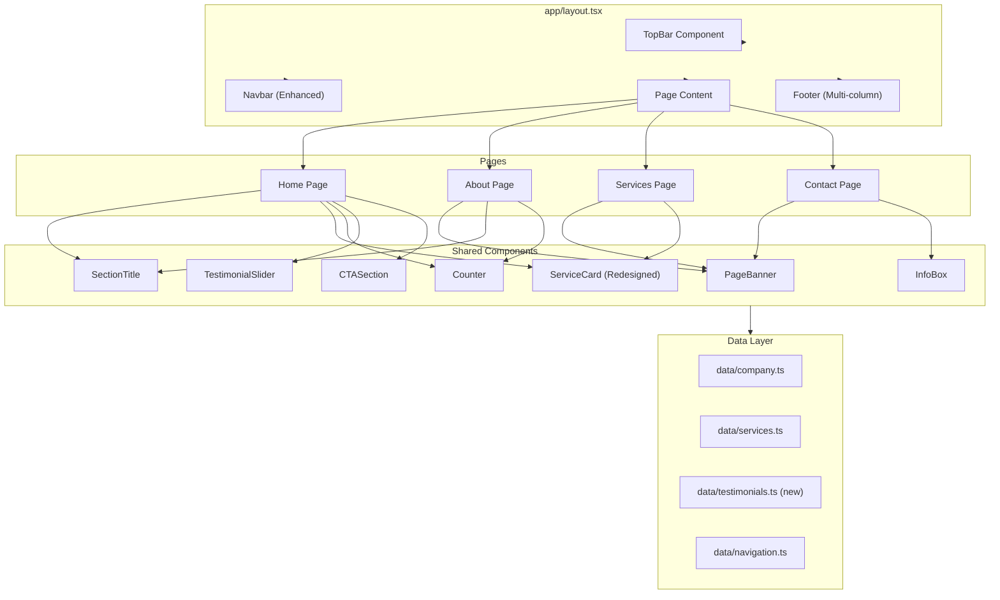
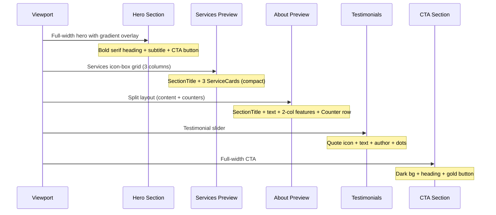
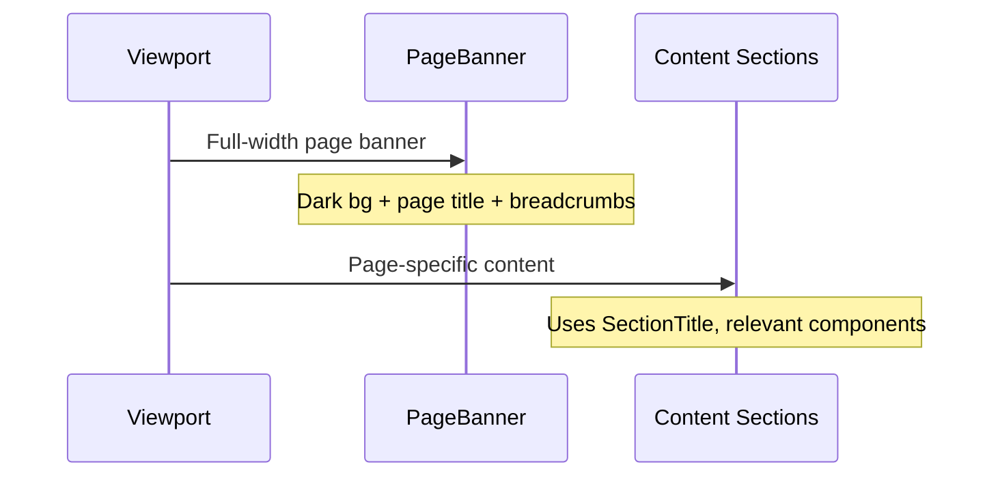

# Design Document: Finano Design Update

## Overview

This design upgrades the visual presentation of the "Cabinet de Gestion et Conseil" Next.js website to match the premium Finano HTML template's design patterns. The update introduces a more polished, professional look with enhanced typography, structured section layouts, animated counters, testimonial displays, page banners, and a multi-column footer — all while preserving the existing gold (#C9A227) and dark (#1A1A1A) color palette, Tailwind CSS approach, accessibility standards, and static site architecture.

The redesign focuses on six key areas: (1) enhanced header with top contact bar, (2) full-width hero section with bold typography, (3) Finano-style service cards with icon boxes, (4) split-layout about section with animated counters, (5) testimonial and CTA sections, and (6) a rich multi-column footer. All inner pages receive a page title banner with breadcrumb-style navigation.

## Architecture



## Components and Interfaces

### Component 1: TopBar

**Purpose**: Slim contact information bar displayed above the main navbar, showing email, phone, and address. Provides quick access to contact details.

**Interface**:
```typescript
// components/TopBar.tsx
interface TopBarProps {
  className?: string;
}

export default function TopBar({ className }: TopBarProps): JSX.Element;
```

**Responsibilities**:
- Display company email, phone number, and address in a slim horizontal bar
- Use dark background (#1A1A1A) with gold accents for contact info
- Hide on mobile (shown only on md+ breakpoints) to save vertical space
- Pull contact data from `data/company.ts`

**Visual Pattern**:
- Height: ~40px
- Background: `bg-dark` (#1A1A1A)
- Text: small white text with gold icons
- Layout: flex row, contact info left-aligned, social links right-aligned

---

### Component 2: Navbar (Enhanced)

**Purpose**: Upgraded sticky navigation with more visual weight, prominent branding area, and improved mobile experience.

**Interface**:
```typescript
// components/Navbar.tsx (updated)
// Same interface, enhanced styling
export default function Navbar(): JSX.Element;
```

**Responsibilities**:
- Sticky positioning below TopBar
- More prominent logo/brand area with larger font or logo image placeholder
- Add subtle background transition on scroll (transparent → white with shadow)
- Maintain existing mobile hamburger menu behavior
- Active link indicator with gold underline

**Visual Pattern**:
- Height: ~70px (increased from 56px)
- Background: white with `shadow-md` on scroll
- Brand: serif font (Playfair Display) for company name
- Links: Poppins/sans-serif, medium weight

---

### Component 3: PageBanner

**Purpose**: Full-width page title banner for inner pages (About, Services, Contact) with background pattern/gradient overlay and breadcrumb navigation.

**Interface**:
```typescript
// components/PageBanner.tsx
interface PageBannerProps {
  title: string;
  breadcrumbs: { label: string; href?: string }[];
  className?: string;
}

export default function PageBanner({ title, breadcrumbs, className }: PageBannerProps): JSX.Element;
```

**Responsibilities**:
- Display page title in large serif heading
- Show breadcrumb trail (Home > Current Page)
- Dark background with subtle gold gradient or pattern overlay
- Responsive padding adjustments

**Visual Pattern**:
- Height: ~200px on desktop, ~150px on mobile
- Background: dark gradient with subtle gold accent line at bottom
- Title: white, serif font, centered
- Breadcrumbs: small text, gold links, centered below title

---

### Component 4: SectionTitle

**Purpose**: Reusable section title pattern matching Finano's "small uppercase label + large heading with accent span" design.

**Interface**:
```typescript
// components/ui/SectionTitle.tsx
interface SectionTitleProps {
  label: string;          // Small uppercase colored label (e.g., "à propos")
  heading: string;        // Main heading text
  accentWord?: string;    // Word to highlight in gold within heading
  description?: string;   // Optional supporting paragraph
  centered?: boolean;     // Center alignment (default: false)
  className?: string;
}

export default function SectionTitle({
  label,
  heading,
  accentWord,
  description,
  centered,
  className,
}: SectionTitleProps): JSX.Element;
```

**Responsibilities**:
- Render small uppercase gold label above the heading
- Render large serif heading with optional gold-highlighted accent word
- Optionally render a description paragraph below
- Support both left-aligned and centered layouts

**Visual Pattern**:
- Label: uppercase, small (text-sm), gold color, letter-spacing wide
- Heading: serif font (Playfair Display), text-heading-lg or text-heading-xl
- Accent word: wrapped in `<span>` with gold color
- Description: body text, muted color, max-width for readability

---

### Component 5: Counter

**Purpose**: Animated number counter that counts up from 0 to a target value when scrolled into view. Used for statistics (clients served, projects completed, years experience).

**Interface**:
```typescript
// components/ui/Counter.tsx
interface CounterProps {
  target: number;         // Final number to count to
  suffix?: string;        // Text after number (e.g., "+", "%")
  label: string;          // Description below the number
  duration?: number;      // Animation duration in ms (default: 2000)
  className?: string;
}

export default function Counter({
  target,
  suffix,
  label,
  duration,
  className,
}: CounterProps): JSX.Element;
```

**Responsibilities**:
- Animate from 0 to target number using Intersection Observer
- Only animate once when first scrolled into view
- Respect `prefers-reduced-motion` (show final number immediately)
- Display suffix after number and label below

**Visual Pattern**:
- Number: large bold text (text-4xl or text-5xl), gold color
- Suffix: same size, gold color
- Label: smaller text below, dark/muted color
- Animation: easeOut curve over 2 seconds

---

### Component 6: TestimonialSlider

**Purpose**: Simple testimonial display showing client quotes with navigation. CSS-only or state-based approach (no external carousel library).

**Interface**:
```typescript
// components/TestimonialSlider.tsx
interface Testimonial {
  id: string;
  quote: string;
  name: string;
  role: string;
  company?: string;
}

interface TestimonialSliderProps {
  testimonials: Testimonial[];
  className?: string;
}

export default function TestimonialSlider({
  testimonials,
  className,
}: TestimonialSliderProps): JSX.Element;
```

**Responsibilities**:
- Display one testimonial at a time with quote icon, text, author name, and role
- Provide navigation dots or prev/next buttons
- Auto-advance every 5 seconds (pause on hover/focus)
- Respect `prefers-reduced-motion` (disable auto-advance)
- Accessible: proper ARIA labels, keyboard navigation

**Visual Pattern**:
- Centered layout, max-width container
- Large quote icon (gold) above testimonial text
- Quote text: italic, larger body text
- Author: bold name + muted role below
- Navigation dots: small circles, gold active state

---

### Component 7: InfoBox

**Purpose**: Styled contact information box with icon, used on the Contact page.

**Interface**:
```typescript
// components/ui/InfoBox.tsx
interface InfoBoxProps {
  icon: 'location' | 'email' | 'phone' | 'clock';
  title: string;
  content: string | string[];
  href?: string;          // Optional link (for email/phone)
  className?: string;
}

export default function InfoBox({
  icon,
  title,
  content,
  href,
  className,
}: InfoBoxProps): JSX.Element;
```

**Responsibilities**:
- Display icon in a gold-bordered circle
- Show title and content below
- Optionally wrap content in a link (for clickable email/phone)
- Hover effect with subtle shadow elevation

**Visual Pattern**:
- Icon: 48x48 circle with gold border, gold icon inside
- Title: bold, dark text
- Content: muted text, clickable if href provided
- Card: white background, subtle border, rounded corners

---

### Component 8: CTASection

**Purpose**: Full-width call-to-action section with contrasting background, bold text, and prominent button.

**Interface**:
```typescript
// components/CTASection.tsx
interface CTASectionProps {
  heading: string;
  description?: string;
  buttonText: string;
  buttonHref: string;
  variant?: 'dark' | 'gold';  // Background style
  className?: string;
}

export default function CTASection({
  heading,
  description,
  buttonText,
  buttonHref,
  variant,
  className,
}: CTASectionProps): JSX.Element;
```

**Responsibilities**:
- Full-width section with dark or gold background
- Centered heading and optional description
- Prominent CTA button with arrow icon
- Responsive padding

**Visual Pattern**:
- Dark variant: `bg-dark` background, white text, gold button
- Gold variant: `bg-gold` background, dark text, dark button
- Padding: generous vertical spacing (py-16 to py-20)

---

### Component 9: ServiceCard (Redesigned)

**Purpose**: Updated service card matching Finano's icon-box style with large icon, title, short description, and "Voir" link.

**Interface**:
```typescript
// components/ServiceCard.tsx (updated)
interface ServiceCardProps {
  title: string;
  description: string;
  benefits: string[];
  icon: string;
  href?: string;          // Link to service detail (future)
}

export default function ServiceCard({
  title,
  description,
  benefits,
  icon,
  href,
}: ServiceCardProps): JSX.Element;
```

**Responsibilities**:
- Display large icon in a styled icon box (gold background circle or bordered box)
- Show title and short description
- Include a "Voir" link with arrow/plus icon
- Hover effect: card elevation + icon color transition
- Two display modes: compact (icon-box for home) and detailed (with benefits list for services page)

**Visual Pattern**:
- Icon box: 80x80px, gold background with opacity, centered icon
- Title: serif font, medium size
- Description: truncated to 2-3 lines on home, full on services page
- Link: gold text with arrow, positioned at bottom

## Data Models

### Model 1: Testimonial Data

```typescript
// data/testimonials.ts
export interface Testimonial {
  id: string;
  quote: string;
  name: string;
  role: string;
  company?: string;
}

export const testimonials: Testimonial[] = [
  {
    id: 'testimonial-1',
    quote: 'Le Cabinet de Gestion et Conseil nous accompagne depuis 5 ans...',
    name: 'Ahmed Benali',
    role: 'Directeur Général',
    company: 'Société Marocaine de Distribution',
  },
  // ... more testimonials
];
```

**Validation Rules**:
- `id` must be unique across all testimonials
- `quote` must be non-empty string
- `name` must be non-empty string
- `role` must be non-empty string

---

### Model 2: Company Data (Extended)

```typescript
// data/company.ts (extended)
export interface CompanyStats {
  clientsServed: number;
  projectsCompleted: number;
  yearsExperience: number;
  teamMembers: number;
}

export interface CompanyContact {
  email: string;
  phone: string;
  address: string;
  city: string;
  socialLinks: {
    facebook?: string;
    linkedin?: string;
    twitter?: string;
  };
}

export interface CompanyData {
  name: string;
  mission: string;
  vision: string;
  values: CompanyValue[];
  stats: CompanyStats;
  contact: CompanyContact;
}
```

**Validation Rules**:
- All stat numbers must be positive integers
- Email must be valid email format
- Phone must be valid Moroccan phone format
- Social links must be valid URLs if provided

---

### Model 3: Navigation (Extended)

```typescript
// data/navigation.ts (extended)
export interface NavLink {
  label: string;
  href: string;
}

export interface FooterColumn {
  title: string;
  links: NavLink[];
}

export const footerColumns: FooterColumn[] = [
  {
    title: 'Services',
    links: [
      { label: 'Comptabilité', href: '/services#accounting' },
      { label: 'Conseil', href: '/services#advisory' },
      { label: 'Audit', href: '/services#audit' },
      { label: 'Création d\'entreprises', href: '/services#company-creation' },
    ],
  },
  {
    title: 'Cabinet',
    links: [
      { label: 'À propos', href: '/about' },
      { label: 'Notre équipe', href: '/about#team' },
      { label: 'Contact', href: '/contact' },
    ],
  },
];
```

## Error Handling

### Error Scenario 1: Counter Animation Failure

**Condition**: Intersection Observer not supported in browser
**Response**: Display the final target number immediately without animation
**Recovery**: Graceful degradation — content is always visible

### Error Scenario 2: Testimonial Empty State

**Condition**: Testimonials array is empty or undefined
**Response**: Hide the testimonial section entirely
**Recovery**: No visual disruption to page layout

### Error Scenario 3: Missing Contact Data

**Condition**: Company contact data fields are missing or malformed
**Response**: TopBar and InfoBox components render only available data
**Recovery**: Components handle undefined/null gracefully with conditional rendering

### Error Scenario 4: Image Loading Failure

**Condition**: Background images for PageBanner or hero fail to load
**Response**: Fallback to solid dark gradient background
**Recovery**: CSS background with gradient ensures visual consistency

## Testing Strategy

### Unit Testing Approach

- Test each new component renders correctly with valid props
- Test conditional rendering (empty states, missing optional props)
- Test accessibility: proper ARIA attributes, keyboard navigation
- Test responsive behavior through className assertions
- Test Counter animation logic (start/stop, final value)

### Integration Testing Approach

- Test page-level rendering with all components composed together
- Test navigation flow between pages
- Test that data from static files renders correctly in components
- Test mobile menu behavior with TopBar integration

## Performance Considerations

- **Font Loading**: Use `next/font` for Playfair Display and Poppins to avoid layout shift (FOUT)
- **CSS-only Animations**: Counter uses requestAnimationFrame, no heavy JS libraries
- **Intersection Observer**: Lazy-trigger animations only when elements enter viewport
- **Image Optimization**: Use `next/image` for any background images with proper sizing
- **Bundle Size**: No external carousel/animation libraries — all custom CSS/JS
- **Static Generation**: All pages remain statically generated at build time

## Security Considerations

- **External Links**: All social media links use `rel="noopener noreferrer"` and `target="_blank"`
- **Form Handling**: Contact form maintains existing client-side validation
- **Content Security**: No user-generated content; all data is static
- **Accessibility**: Maintain WCAG AA compliance across all new components

## Dependencies

- **next/font**: For loading Playfair Display (serif) and Poppins (sans-serif) — already available in Next.js
- **Tailwind CSS**: Existing dependency, extended configuration for new design tokens
- **No new external dependencies**: All components built with React + Tailwind + CSS

## Typography System

### Font Pairing

| Usage | Font | Weight | Fallback |
|-------|------|--------|----------|
| Headings (h1, h2) | Playfair Display | 700 (Bold) | Georgia, serif |
| Subheadings (h3, h4) | Poppins | 600 (Semibold) | system-ui, sans-serif |
| Body text | Poppins | 400 (Regular) | system-ui, sans-serif |
| Labels/Small | Poppins | 500 (Medium) | system-ui, sans-serif |

### Spacing Scale Update

| Token | Current | New | Usage |
|-------|---------|-----|-------|
| section-padding | 48px | 80px (desktop), 48px (mobile) | Vertical section spacing |
| container-max | 1280px | 1280px (unchanged) | Max content width |
| component-gap | 24px | 32px | Gap between cards/items |

## Page Layouts

### Home Page Structure



### Inner Page Structure (About/Services/Contact)



## Correctness Properties

*A property is a characteristic or behavior that should hold true across all valid executions of a system — essentially, a formal statement about what the system should do. Properties serve as the bridge between human-readable specifications and machine-verifiable correctness guarantees.*

### Property 1: PageBanner renders all breadcrumb items in order

*For any* array of breadcrumb items passed to PageBanner, the rendered output SHALL contain all breadcrumb labels in the correct sequential order with proper separator elements between them.

**Validates: Requirements 5.2**

### Property 2: SectionTitle accent word highlighting

*For any* heading string and accent word that exists as a substring within that heading, the SectionTitle component SHALL wrap exactly that word in a styled span element with gold color, leaving the rest of the heading text unchanged.

**Validates: Requirements 6.3**

### Property 3: Counter final value equals target

*For any* positive integer target value, after the Counter animation completes (or immediately if reduced motion is preferred), the displayed number SHALL equal exactly the target value.

**Validates: Requirements 7.1, 7.4**

### Property 4: TestimonialSlider renders testimonial data with correct navigation

*For any* non-empty array of N testimonials, the TestimonialSlider SHALL render the active testimonial's quote, name, and role, and SHALL provide exactly N navigation dots.

**Validates: Requirements 8.1, 8.2**

### Property 5: Footer renders all links from footer columns data

*For any* set of footer columns defined in the navigation data, the Footer component SHALL render every link from every column with the correct label and href.

**Validates: Requirements 12.2**

### Property 6: Services page renders all services from data

*For any* set of services defined in the services data file, the Services page SHALL render a ServiceCard for each service displaying its title and description.

**Validates: Requirements 15.2**
