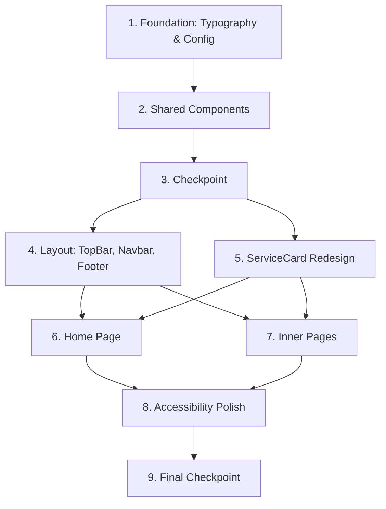

# Implementation Plan: Finano Design Update

## Overview

This plan implements the Finano design update for the "Cabinet de Gestion et Conseil" website. Tasks are ordered to build foundation first (fonts, config, data), then shared components, then layout changes, and finally page updates. Each task builds incrementally on previous work.

## Tasks

- [x] 1. Foundation: Typography and Tailwind Configuration
  - [x] 1.1 Configure fonts with next/font/google
    - Add Playfair Display (weight 700) and Poppins (weights 400, 500, 600) in `app/layout.tsx` using `next/font/google`
    - Apply font CSS variables to the `<html>` element
    - Update `styles/globals.css` with font-family custom properties
    - _Requirements: 1.1, 1.4, 1.5_

  - [x] 1.2 Update Tailwind configuration
    - Extend `tailwind.config.ts` with `fontFamily` entries: `serif` (Playfair Display) and `sans` (Poppins)
    - Update section spacing token to 80px desktop / 48px mobile
    - Add `component-gap` spacing token (32px)
    - Verify existing color tokens remain unchanged
    - _Requirements: 2.1, 2.2, 2.3, 2.4_

  - [x] 1.3 Extend data models
    - Add `stats` and `contact` fields to `CompanyData` interface and `company` object in `data/company.ts`
    - Create `data/testimonials.ts` with `Testimonial` interface and sample testimonials (in French)
    - Add `FooterColumn` interface and `footerColumns` export to `data/navigation.ts`
    - _Requirements: 17.1, 17.2, 17.3, 17.4_

- [x] 2. Shared Components: UI Building Blocks
  - [x] 2.1 Create SectionTitle component
    - Create `components/ui/SectionTitle.tsx` with props: label, heading, accentWord, description, centered, className
    - Render uppercase gold label, serif heading with optional gold accent word, optional description
    - Support centered and left-aligned layouts
    - _Requirements: 6.1, 6.2, 6.3, 6.4, 6.5_

  - [x]* 2.2 Write property test for SectionTitle accent word
    - **Property 2: SectionTitle accent word highlighting**
    - **Validates: Requirement 6.3**

  - [x] 2.3 Create PageBanner component
    - Create `components/PageBanner.tsx` with props: title, breadcrumbs, className
    - Render dark gradient background with gold accent line at bottom
    - Display centered serif title and breadcrumb trail with separators
    - Responsive height: ~200px desktop, ~150px mobile
    - _Requirements: 5.1, 5.2, 5.3, 5.4, 5.5_

  - [ ]* 2.4 Write property test for PageBanner breadcrumbs
    - **Property 1: PageBanner renders all breadcrumb items in order**
    - **Validates: Requirement 5.2**

  - [x] 2.5 Create Counter component
    - Create `components/ui/Counter.tsx` with props: target, suffix, label, duration, className
    - Use `'use client'` directive for Intersection Observer and state
    - Animate from 0 to target with easeOut curve using requestAnimationFrame
    - Trigger animation only once on first viewport intersection
    - Respect `prefers-reduced-motion` (show final value immediately)
    - _Requirements: 7.1, 7.2, 7.3, 7.4, 7.5, 7.6_

  - [ ]* 2.6 Write property test for Counter final value
    - **Property 3: Counter final value equals target**
    - **Validates: Requirements 7.1, 7.4**

  - [x] 2.7 Create InfoBox component
    - Create `components/ui/InfoBox.tsx` with props: icon, title, content, href, className
    - Render icon in gold-bordered circle (48x48px)
    - Display title and content, optionally wrapped in link
    - Add hover shadow elevation effect
    - _Requirements: 9.1, 9.2, 9.3, 9.4_

  - [x] 2.8 Create CTASection component
    - Create `components/CTASection.tsx` with props: heading, description, buttonText, buttonHref, variant, className
    - Support "dark" variant (dark bg, white text, gold button) and "gold" variant (gold bg, dark text, dark button)
    - Full-width section with centered content and generous padding
    - _Requirements: 10.1, 10.2, 10.3, 10.4, 10.5_

  - [x] 2.9 Create TestimonialSlider component
    - Create `components/TestimonialSlider.tsx` with props: testimonials, className
    - Use `'use client'` directive for state management
    - Display one testimonial at a time with quote icon, text, author name, and role
    - Add navigation dots, auto-advance every 5s, pause on hover/focus
    - Respect `prefers-reduced-motion` (disable auto-advance)
    - Support keyboard navigation (arrow keys for prev/next)
    - Handle empty array gracefully (render nothing)
    - _Requirements: 8.1, 8.2, 8.3, 8.4, 8.5, 8.6, 8.7_

  - [ ]* 2.10 Write property test for TestimonialSlider
    - **Property 4: TestimonialSlider renders testimonial data with correct navigation**
    - **Validates: Requirements 8.1, 8.2**

- [x] 3. Checkpoint - Foundation and shared components
  - Ensure all tests pass, ask the user if questions arise.

- [x] 4. Layout: TopBar, Navbar Enhancement, Footer Redesign
  - [x] 4.1 Create TopBar component
    - Create `components/TopBar.tsx` with dark background bar
    - Display email, phone, address from `data/company.ts` contact data
    - Show social links on the right when available
    - Hidden on mobile (below `md` breakpoint)
    - _Requirements: 3.1, 3.2, 3.3, 3.4_

  - [x] 4.2 Enhance Navbar component
    - Update `components/Navbar.tsx` with larger branding (serif font, bigger text)
    - Increase min-height to 70px
    - Add scroll-based background transition (transparent → white with shadow) using `'use client'` scroll listener
    - Maintain existing mobile menu and accessibility
    - _Requirements: 4.1, 4.2, 4.3, 4.4, 4.5_

  - [x] 4.3 Redesign Footer component
    - Rewrite `components/Footer.tsx` as multi-column layout
    - Column 1: Company name + brief description
    - Column 2: Service links from `footerColumns`
    - Column 3: Cabinet links from `footerColumns`
    - Column 4: Contact info (address, phone, email)
    - Copyright notice at bottom
    - Dark background with white/gold text
    - _Requirements: 12.1, 12.2, 12.3, 12.4, 12.5, 12.6_

  - [ ]* 4.4 Write property test for Footer links rendering
    - **Property 5: Footer renders all links from footer columns data**
    - **Validates: Requirement 12.2**

  - [x] 4.5 Update root layout integration
    - Update `app/layout.tsx` to render TopBar above Navbar
    - Ensure sticky positioning works correctly with TopBar + Navbar combination
    - Apply font classes to body element
    - _Requirements: 19.1, 19.2, 19.3, 19.4_

- [x] 5. Redesign ServiceCard component
  - [x] 5.1 Update ServiceCard with Finano icon-box style
    - Redesign `components/ServiceCard.tsx` with large icon box (80x80px, gold bg with opacity)
    - Use serif font for title
    - Add "Voir" link with arrow icon at bottom
    - Add hover effect: card elevation + icon color transition
    - Maintain benefits list for detailed mode (services page)
    - _Requirements: 11.1, 11.2, 11.3, 11.4, 11.5_

- [x] 6. Page Updates: Home Page
  - [x] 6.1 Rebuild Home page with Finano layout
    - Replace current home page content in `app/page.tsx`
    - Add full-width hero section with bold serif heading, subtitle, gradient overlay, and CTA button
    - Add services preview section with SectionTitle + 3 compact ServiceCards
    - Add about preview section with text + Counter row (stats from company data)
    - Add TestimonialSlider section
    - Add CTASection at bottom
    - _Requirements: 13.1, 13.2, 13.3, 13.4, 13.5_

- [x] 7. Page Updates: Inner Pages
  - [x] 7.1 Update About page
    - Add PageBanner with title "À propos" and breadcrumbs
    - Use SectionTitle components for mission, vision, values sections
    - Add Counter components showing company statistics
    - Maintain existing content (mission, vision, values)
    - _Requirements: 14.1, 14.2, 14.3, 14.4_

  - [x] 7.2 Update Services page
    - Add PageBanner with title "Nos Services" and breadcrumbs
    - Use SectionTitle for main heading
    - Display all services with redesigned ServiceCard (full details with benefits)
    - _Requirements: 15.1, 15.2, 15.3_

  - [ ]* 7.3 Write property test for Services page rendering all services
    - **Property 6: Services page renders all services from data**
    - **Validates: Requirement 15.2**

  - [x] 7.4 Update Contact page
    - Add PageBanner with title "Contact" and breadcrumbs
    - Replace inline contact info with InfoBox components (address, email, phone, hours)
    - Maintain existing contact form with all validation and accessibility
    - _Requirements: 16.1, 16.2, 16.3_

- [x] 8. Accessibility and Final Polish
  - [x] 8.1 Verify accessibility across all new components
    - Ensure proper ARIA labels on all interactive elements
    - Verify keyboard navigation works for TestimonialSlider and mobile menu
    - Confirm 44x44px minimum touch targets on all interactive elements
    - Test `prefers-reduced-motion` disables animations in Counter and TestimonialSlider
    - _Requirements: 18.1, 18.2, 18.3, 18.4, 18.5_

- [x] 9. Final checkpoint - Ensure all tests pass
  - Ensure all tests pass, ask the user if questions arise.

## Notes

- Tasks marked with `*` are optional and can be skipped for faster MVP
- Each task references specific requirements for traceability
- Checkpoints ensure incremental validation
- Property tests validate universal correctness properties
- All content (labels, headings, testimonials) must be in French
- No external animation or carousel libraries — all custom CSS/JS with React state
- Use `next/font/google` for font loading to prevent layout shift

## Task Dependency Graph



```json
{
  "waves": [
    { "tasks": ["1"] },
    { "tasks": ["2"] },
    { "tasks": ["3"] },
    { "tasks": ["4", "5"] },
    { "tasks": ["6", "7"] },
    { "tasks": ["8"] },
    { "tasks": ["9"] }
  ]
}
```
